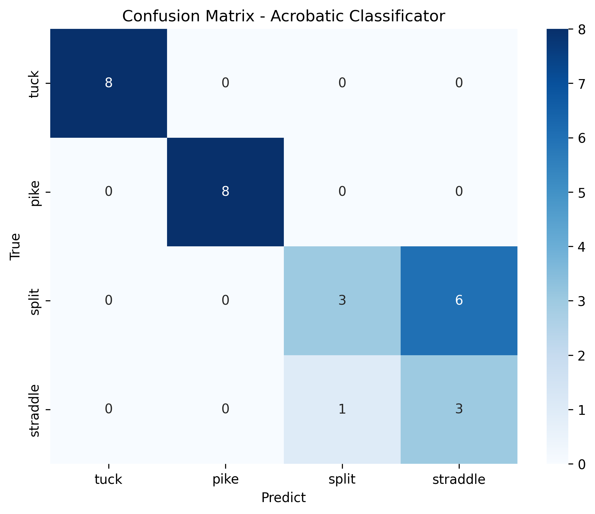
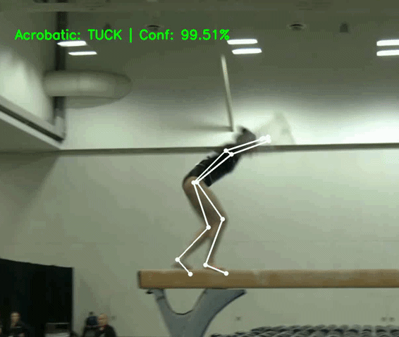
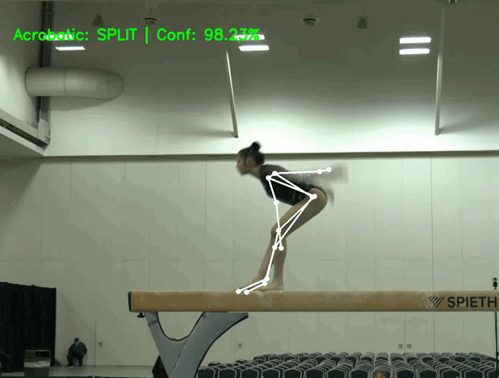

## <samp>METRICS AND MODEL EVALUATION</samp>

This directory contains the evaluation results, charts, and performance metrics of the complete Artificial Intelligence pipeline developed for this Final Degree Thesis. The project is divided into two main phases, whose metrics are detailed below.

---

### <samp>*EXTRACTION PHASE*: HPE Models Comparison</samp>

For the first phase of the project, a comparative study between different pose estimation models was conducted to determine which was most capable of handling the occlusions and extreme angles typical of acrobatic gymnastics.

| Model | mAP@0.5 | mAP@0.75 | PCK@0.2 |
| :--- | :---: | :---: | :---: |
| **_YOLOv8x-pose_** | 19.2% | 9.3% | 44.0% |
| **_MediaPipe BlazePose_** | 13.4% | 6.9% | 35.4% |
| **_Sapiens-2B_** | **36.6%** | **19.2%** | **72.7%** |

*Table 1: Evaluation on an acrobatic segment on the balance beam.*

> _<samp>**NOTE:**</samp> The final extraction of the 2D/3D skeletons that feed the neural network is performed using the weights `sapiens_2b_coco_wholebody_best_coco_wholebody_AP_745.pth`._

---

### <samp>*CLASSIFICATION PHASE:* Recurrent Neural Network (RNN)</samp>

The temporal classification model (RNN) was evaluated with a validation dataset (20% of the total dataset, never before seen by the model). Below are the results of the `best.pth` file (Early Stopping applied at the best epoch).

#### <samp>> *GENERAL PERFORMANCE*</samp>

**_<samp>Global Accuracy:_** _76.0%_</samp>
**_<samp>Total test videos_:** _29 exercises_</samp>

#### <samp>> *CLASSIFICATION REPORT*</samp>

| Acrobatic | Precision | Recall | F1-Score | Support (Videos) |
| :---: | :---: | :---: | :---: | :---: |
| **Tuck** | 100.0%| 100.0% | 100.0% | 8 |
| **Pike** | 100.0%| 100.0% | 100.0% | 8 |
| **Split** | 75.0% | 33.0% | 46.0% | 9 |
| **Straddle** | 33.0% | 75.0% | 46.0% | 4 |
| **_Macro Avg_** | **_77.0%_** | **_77.0%_** | **_73.0%_** | **_29_** |
| **_Weighted Avg_** | **_83.0%_** | **_76.0%_** | **_76.0%_** | **_29_** |

  

> *The image file is automatically generated by the evaluation script.*

#### <samp>> *RESULTS ANALYSIS*</samp>

The data demonstrates a strongly polarized learning in the model:

<samp>**_PERFECT DETECTION (TUCK & PIKE)_**</samp>

The model has perfectly learned the difference between flexed and frontally extended limbs, achieving a 100% success rate in these two categories.

<samp>**_OPENING BIAS (SPLIT & STRADDLE)_** </samp>

The drop in overall accuracy to 76% is exclusively due to the confusion between Split and Straddle. The model has a bias towards predicting Straddle (high false positive rate, precision of 33%), erroneously classifying 66% of Split jumps as Straddles. This indicates that the network has difficulties discerning three-dimensional depth or the hip opening angle (frontal vs. lateral) based solely on the 2D coordinates extracted from certain camera angles. 

From a practical and logical standpoint within the domain of gymnastics scoring, this confusion is not considered a critical failure, but rather an architectural observation. To resolve this in future versions, a full retraining of the model is proposed by introducing a new `orientation` sub-dictionary to the input sequence (alongside `position`, `velocity`, `acceleration`, and `angles`) to explicitly provide the network with the necessary 3D spatial awareness.

---

#### <samp>> *VISUAL DEMONSTRATION*</samp>

Below are examples of the model's output in action, demonstrating the pose extraction and the RNN's real-time prediction confidence.

  <table>
    <tr>
      <td align="center">
        
      </td>
      <td align="center">
        
      </td>
    </tr>
  </table>

